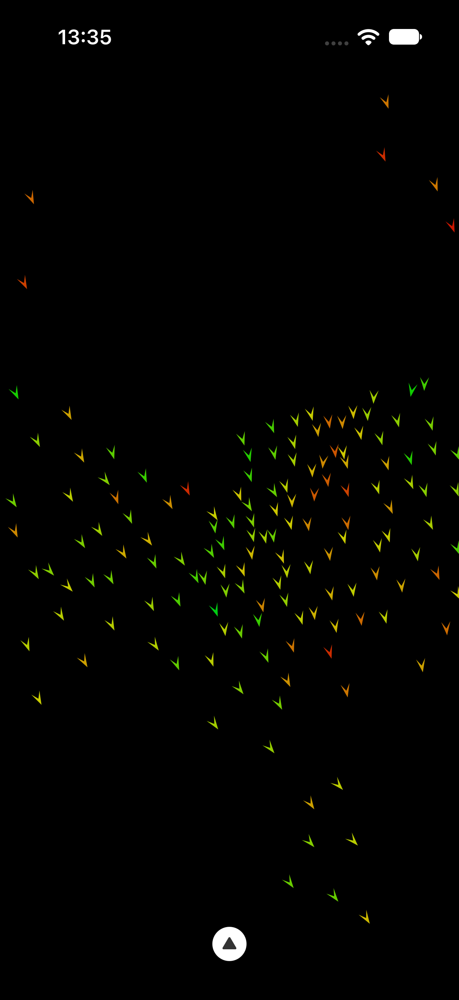
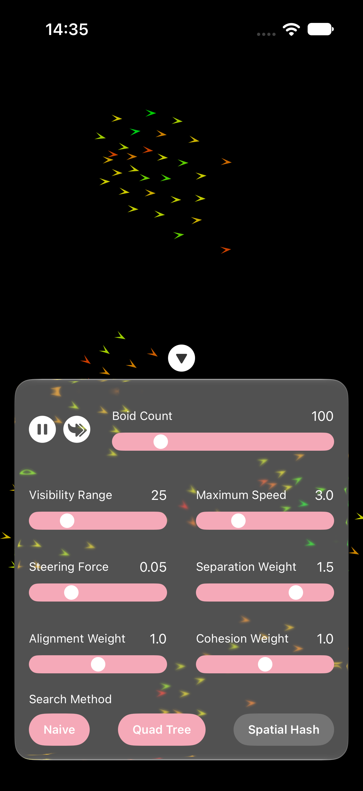

# Simulation Boids 2D
A Swift implementation of the [Boids](https://en.wikipedia.org/wiki/Boids) algorithm, optimised using **Spatial Hash ( & Quad Tree)**  and **Tasks (Actors)** for a faster and lightweight simulation.

## Features
- Press on screen to enable a seeking object for the Boids to follow and see them dance
- Boid Parameters can be changed during initialisation 
- Assistive Menu to change Boid Parameters in real-time, along with pause-play frames feature

## Requirements
- iOS 17.0 or later
- macOS 14.0 or later
- Swift 5.9 or later
- Xcode 15 or later
## Installation
### Xcode
1. Open your project in Xcode.
2. Select **File → Add Package Dependencies**
3. Enter the repository URL: "https://github.com/Fasith-23/SimulationBoids2D"
4. Select a version (check tags to find the latest)
5. Add the package
### In Code
1. Import SimulationBoids2D in the file. 
2. Add BoidsView() just like any other view. See Below
``` swift
import SwiftUI
import SimulationBoids2D

struct ContentView: View {
    var body: some View {
        ZStack {          
            BoidsView()            
        }
    }
}
```

#### Parameters
There are 10 boid parameters that can be changed if needed. See Below.
```swift
BoidsView(boidParameters: .init(boidCount: 120))
BoidsView(boidParameters: .init(boidCount: 200, steeringForce : 10, searchMethod: .quadTree))  
BoidsView(boidParameters: .init(visibilityRange: 30, searchMethod: .spatialHash))
```

#### Menu
Alternatively, an UI Menu to change parameters in real time can be enabled
```swift
BoidsView(displayMenu: true)
```
- Switch between Spatial Hash, Quad Tree and Naive algorithms to check the speed and smoothness of the app 
- Adjust Boid parameters in real time to see how varying the boids can move
- Pause and go frame by frame if you are keen on a particular boid's movement

## Demo
Watch the demo [here](https://www.youtube.com/shorts/uvtEMP-C2ME) or checkout my demo [code](https://github.com/Fasith-23/BoidsDemo)

 


